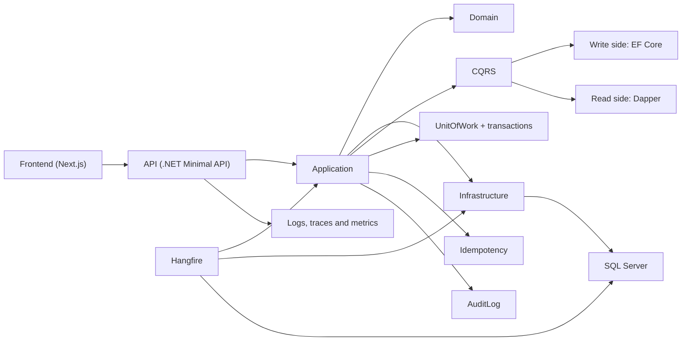
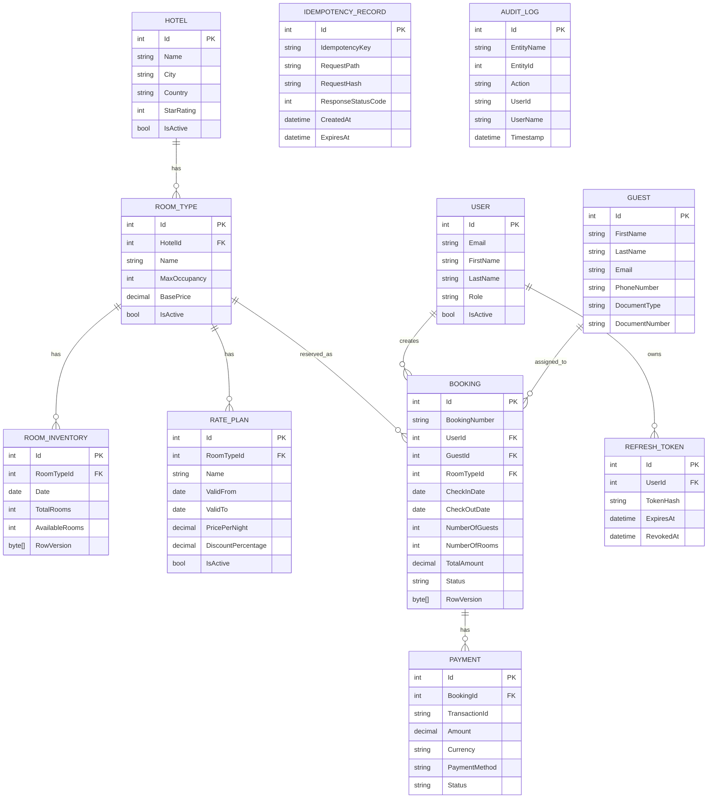

# Hotel Booking Platform

Plataforma de reservas de hoteles construida como solucion end-to-end con API en `.NET`, frontend desacoplado en `Next.js`, SQL Server, CQRS, control de concurrencia, idempotencia y observabilidad. La entrega prioriza arquitectura, consistencia transaccional y una experiencia de evaluacion simple.

## Tabla de contenido

- [Inicio rapido](#inicio-rapido)
- [Resumen](#resumen)
- [Arquitectura](#arquitectura)
- [Estructura del repositorio](#estructura-del-repositorio)
- [Funcionalidad implementada](#funcionalidad-implementada)
- [Decisiones tecnicas](#decisiones-tecnicas)
- [Ejecucion local sin Docker](#ejecucion-local-sin-docker)
- [Docker](#docker)
- [Postman](#postman)
- [Pruebas](#pruebas)
- [Datos de demo](#datos-de-demo)
- [Limitaciones conocidas](#limitaciones-conocidas)
- [Diagrama relacional](#diagrama-relacional)

## Inicio rapido

La revision principal esta pensada para ejecutarse con un solo comando:

```powershell
docker compose up --build
```

Requisitos:

- Docker Desktop con `docker compose`
- Puertos libres `3000`, `5000`, `5002` y `1433`

Que debe ocurrir:

- SQL Server inicia en `localhost,1433`
- La API aplica migraciones y seed automaticamente
- El frontend queda disponible en `http://localhost:3000`
- La API queda disponible en `http://localhost:5000`
- Hangfire queda disponible en `http://localhost:5002/hangfire`

Verificacion rapida:

- Frontend: `http://localhost:3000`
- Health API: `http://localhost:5000/health`
- OpenAPI: `http://localhost:5000/openapi/v1.json`
- Hangfire: `http://localhost:5002/hangfire`

Modulos del frontend:

- Modulo publico: portal orientado a cliente para buscar hoteles, revisar disponibilidad, crear reservas y administrar sus propias reservas desde `http://localhost:3000`
- Portal admin: superficie operativa para mantenimiento de hoteles, room types, rate plans y revision de auditoria, accesible dentro del frontend con un usuario administrador

Credenciales pre-cargadas para pruebas:

- Cliente: `turismo@hotelbooking.local` / `Guest123!`
- Admin: `admin@hotelbooking.local` / `Admin123!`

Detener y limpiar:

```powershell
docker compose down -v
```

## Resumen

- Clean Architecture con capas `Domain`, `Application`, `Infrastructure`, `Api` y `frontend`
- CQRS obligatorio: `EF Core` para escritura y `Dapper` para lectura
- `UnitOfWork` y transacciones centralizadas en commands
- `Result Pattern` para evitar excepciones como control de flujo
- REST versionado en `/api/v1/...`
- Idempotencia en creacion de reservas mediante `Idempotency-Key`
- Prevencion de overbooking con `RowVersion` sobre inventario
- Observabilidad con `Serilog`, `CorrelationId`, `TraceId` y metricas basicas
- Auditoria minima de eventos criticos de reservas
- Frontend separado en `Next.js`
- Docker Compose para levantar SQL Server, API, Hangfire y frontend

## Arquitectura

Capas:

- `Domain`: entidades, enums, eventos de dominio y reglas nucleares
- `Application`: commands, queries, validaciones, contratos y behaviours
- `Infrastructure`: EF Core, Dapper, autenticacion, idempotencia, auditoria y cache
- `Api`: Minimal API, middleware, versionado, OpenAPI y mapeo HTTP
- `frontend`: cliente `Next.js`
- `Hangfire`: host separado para jobs recurrentes

Diagrama:



## Estructura del repositorio

- [src/Domain](src/Domain)
- [src/Application](src/Application)
- [src/Infrastructure](src/Infrastructure)
- [src/Api](src/Api)
- [src/Hangfire](src/Hangfire)
- [src/frontend](src/frontend)
- [tests/Application.UnitTests](tests/Application.UnitTests)
- [tests/Application.FunctionalTests](tests/Application.FunctionalTests)
- [tests/Infrastructure.IntegrationTests](tests/Infrastructure.IntegrationTests)
- [tests/Domain.UnitTests](tests/Domain.UnitTests)
- [postman](postman)

## Funcionalidad implementada

Backend:

- CRUD de hoteles
- CRUD de tipos de habitacion
- CRUD de rate plans
- Gestion de inventario por fecha
- Busqueda de disponibilidad por hotel, fechas y huespedes
- Creacion de reservas con idempotencia
- Confirmacion y cancelacion de reservas
- Listado y detalle de reservas
- Paginacion y ordenamiento en consultas
- Autenticacion con JWT y refresh tokens
- Autorizacion por rol para endpoints administrativos
- Seed automatico para entorno de desarrollo

Frontend:

- Busqueda de disponibilidad
- Catalogo de hoteles
- Detalle de hotel
- Creacion de reserva
- Listado de reservas del usuario
- Detalle de reserva
- Confirmacion y cancelacion de reserva
- Superficie administrativa para hoteles, room types, rate plans y auditoria
- Estados `loading`, `error` y `empty`

## Decisiones tecnicas

### CQRS

- Escritura con `EF Core`
- Lectura con `Dapper`
- DTOs especificos por endpoint
- Paginacion desde SQL en el read side

Referencias:

- [BookingQueryService.cs](src/Infrastructure/Bookings/BookingQueryService.cs)
- [HotelQueryService.cs](src/Infrastructure/Hotels/HotelQueryService.cs)

### Unit of Work y transacciones

- Todos los commands pasan por un pipeline transaccional
- El `commit` solo ocurre cuando el `Result` es exitoso
- Si falla una validacion o una operacion de negocio, se hace `rollback`

Referencias:

- [TransactionBehaviour.cs](src/Application/Common/Behaviours/TransactionBehaviour.cs)
- [IUnitOfWork.cs](src/Application/Common/Interfaces/IUnitOfWork.cs)
- [UnitOfWork.cs](src/Infrastructure/Data/UnitOfWork.cs)

### Idempotencia

- La creacion de reservas requiere `Idempotency-Key`
- Se persiste la respuesta original y se devuelve exactamente la misma en repeticiones validas

Referencias:

- [IdempotencyEndpointFilter.cs](src/Api/Infrastructure/IdempotencyEndpointFilter.cs)
- [IdempotencyService.cs](src/Infrastructure/Idempotency/IdempotencyService.cs)

### Concurrencia y anti-overbooking

- La estrategia elegida es `optimistic concurrency` con `RowVersion` en `RoomInventory`
- Si dos solicitudes compiten por el mismo inventario, el conflicto se detecta al guardar
- La API responde con resultado controlado sin permitir inventario negativo ni sobreventa

Referencias:

- [RoomInventoryConfiguration.cs](src/Infrastructure/Data/Configurations/RoomInventoryConfiguration.cs)
- [CreateBookingCommand.cs](src/Application/Bookings/Commands/CreateBooking/CreateBookingCommand.cs)
- [CreateBookingConcurrencyTests.cs](tests/Application.FunctionalTests/Bookings/CreateBookingConcurrencyTests.cs)

### Auditoria

Eventos auditados:

- `BookingCreated`
- `BookingConfirmed`
- `BookingCancelled`
- Expiracion automatica de reservas pendientes

Referencias:

- [AuditLog.cs](src/Domain/Entities/AuditLog.cs)
- [AuditLogService.cs](src/Infrastructure/Auditing/AuditLogService.cs)

### Observabilidad

- `Serilog` con logging estructurado
- `CorrelationId` por request
- `TraceId` y `SpanId`
- Middleware de duracion de requests
- Metricas basicas con `Meter`

Referencias:

- [Program.cs](src/Api/Program.cs)
- [RequestCorrelationMiddleware.cs](src/Api/Infrastructure/RequestCorrelationMiddleware.cs)
- [RequestMetricsMiddleware.cs](src/Api/Infrastructure/RequestMetricsMiddleware.cs)

### Bonus implementados

- Expiracion automatica de reservas con `Hangfire`
- `rate limiting`
- Cache de disponibilidad
- Autenticacion JWT simple

Referencias:

- [Program.cs](src/Hangfire/Program.cs)
- [ExpirePendingBookingsJob.cs](src/Hangfire/ExpirePendingBookingsJob.cs)
- [AvailabilityCache.cs](src/Infrastructure/Caching/AvailabilityCache.cs)

## Ejecucion local sin Docker

Requisitos:

- `.NET SDK 10`
- Node.js `20+`
- SQL Server o LocalDB

API:

```powershell
dotnet run --project .\src\Api\Api.csproj
```

Hangfire:

```powershell
dotnet run --project .\src\Hangfire\Hangfire.csproj
```

Frontend:

```powershell
cd .\src\frontend
npm install
npm run generate-api
npm run dev
```

## Docker

Archivos relevantes:

- [docker-compose.yml](docker-compose.yml)
- [src/Api/Dockerfile](src/Api/Dockerfile)
- [src/Hangfire/Dockerfile](src/Hangfire/Dockerfile)
- [src/frontend/Dockerfile](src/frontend/Dockerfile)

Comando principal:

```powershell
docker compose up --build
```

Servicios expuestos:

- Frontend: `http://localhost:3000`
- API: `http://localhost:5000`
- Hangfire: `http://localhost:5002/hangfire`
- SQL Server: `localhost,1433`

Notas:

- El archivo `.env` incluido cubre el escenario local de evaluacion
- El stack fue validado con `docker compose up --build` en este repositorio
- La API y Hangfire usan el mismo SQL Server del compose

## Postman

Archivos:

- [HotelBookingPlatform.postman_collection.json](postman/HotelBookingPlatform.postman_collection.json)
- [HotelBookingPlatform.local.postman_environment.json](postman/HotelBookingPlatform.local.postman_environment.json)

Flujo sugerido:

1. `Auth -> Register Customer` o `Auth -> Login`
2. `Hotels -> Search Available Hotels`
3. `Hotels -> Get Hotel Availability`
4. `Bookings -> Create Booking`
5. `Bookings -> List My Bookings`
6. `Bookings -> Get Booking Detail`
7. `Bookings -> Confirm Booking` o `Cancel Booking`
8. `Admin -> Create Hotel`, `Create Room Type` y `Create Rate Plan`
9. Revisar `AuditLog` o superficie administrativa

## Pruebas

Ejecutar todo:

```powershell
dotnet test
```

Escenarios destacados:

- [CreateBookingConcurrencyTests.cs](tests/Application.FunctionalTests/Bookings/CreateBookingConcurrencyTests.cs)
- [CreateBookingIdempotencyTests.cs](tests/Application.FunctionalTests/Bookings/CreateBookingIdempotencyTests.cs)
- [BookingExpirationServiceTests.cs](tests/Application.FunctionalTests/Bookings/BookingExpirationServiceTests.cs)
- [RateLimitingTests.cs](tests/Application.FunctionalTests/RateLimiting/RateLimitingTests.cs)
- [BookingExpirationRecurringJobSetupServiceTests.cs](tests/Application.UnitTests/Bookings/Jobs/BookingExpirationRecurringJobSetupServiceTests.cs)
- [GetAvailableHotelsQueryHandlerCacheTests.cs](tests/Application.UnitTests/Hotels/Queries/GetAvailableHotelsQueryHandlerCacheTests.cs)
- [BookingTests.cs](tests/Domain.UnitTests/Bookings/BookingTests.cs)

## Datos de demo

Credenciales creadas por el seed automatico:

- Admin: `admin@hotelbooking.local` / `Admin123!`
- Cliente: `cliente@hotelbooking.local` / `Guest123!`

Datos sembrados:

- 2 hoteles
- 3 room types por hotel
- Inventario por 30 dias
- 5 reservas de ejemplo

Uso sugerido para revision:

1. Iniciar sesion como cliente y crear una reserva.
2. Confirmar o cancelar la reserva creada.
3. Iniciar sesion como admin y revisar mantenimiento de hoteles o auditoria.

## Limitaciones conocidas

- `Payment` existe como entidad, pero no se priorizo un flujo completo de pagos
- No se implemento `Outbox pattern`
- El dashboard de Hangfire queda accesible en `Development` para facilitar revision local; para produccion debe endurecerse

## Diagrama relacional


