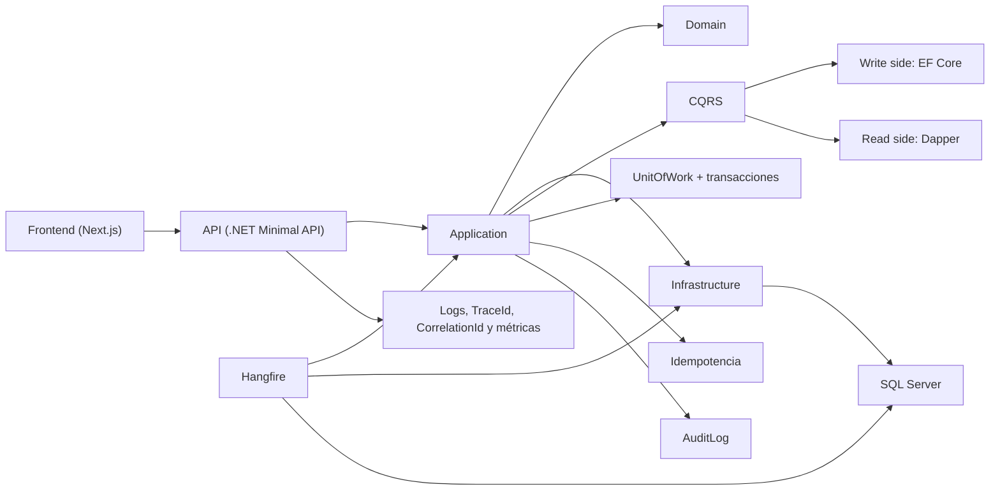
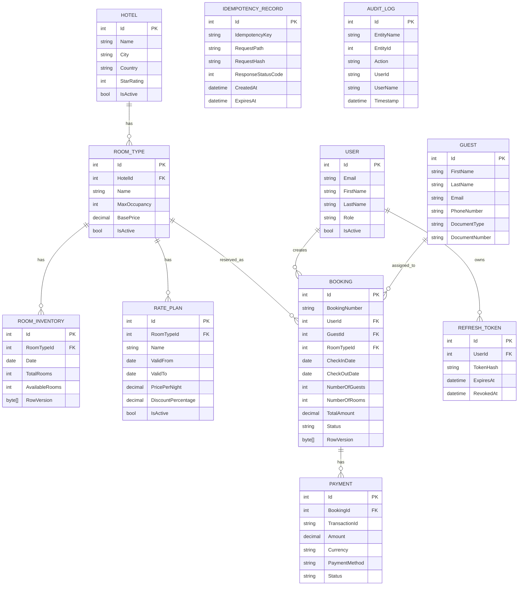

# Hotel Booking Platform

Plataforma de reservas de hoteles construida como solución end-to-end con API en `.NET`, frontend desacoplado en `Next.js`, SQL Server, CQRS, control de concurrencia, idempotencia y observabilidad básica. El objetivo del proyecto es demostrar una implementación sólida para un flujo de reservas con foco en consistencia y mantenibilidad.

## Tabla de contenido

- [Resumen](#resumen)
- [Arquitectura](#arquitectura)
  - [Capas](#capas)
  - [Diagrama](#diagrama)
  - [Estructura principal](#estructura-principal)
- [Funcionalidad principal](#funcionalidad-principal)
  - [Backend](#backend)
  - [Frontend](#frontend)
- [Decisiones técnicas relevantes](#decisiones-técnicas-relevantes)
  - [CQRS](#cqrs)
  - [Transacciones y UnitOfWork](#transacciones-y-unitofwork)
  - [Idempotencia](#idempotencia)
  - [Concurrencia y anti-overbooking](#concurrencia-y-anti-overbooking)
  - [Auditoría](#auditoría)
  - [Observabilidad](#observabilidad)
  - [Expiración automática de reservas](#expiración-automática-de-reservas)
  - [Rate limiting](#rate-limiting)
  - [Cache de disponibilidad](#cache-de-disponibilidad)
- [Estado actual](#estado-actual)
  - [Implementado](#implementado)
  - [Parcial o fuera del foco principal](#parcial-o-fuera-del-foco-principal)
  - [No implementado](#no-implementado)
- [Ejecución local](#ejecución-local)
  - [Requisitos](#requisitos)
  - [API](#api)
  - [Hangfire](#hangfire)
  - [Frontend](#frontend-1)
- [Docker](#docker)
- [Postman](#postman)
- [Pruebas](#pruebas)
- [Datos de demo](#datos-de-demo)
- [Próximos pasos naturales](#próximos-pasos-naturales)

## Resumen

- Arquitectura por capas con `Domain`, `Application`, `Infrastructure`, `Api`, `frontend` y un host separado de `Hangfire`
- `EF Core` en escritura y `Dapper` en lectura
- `UnitOfWork` y transacciones centralizadas para commands
- `Result Pattern` para respuestas de aplicación y mapeo HTTP consistente
- Idempotencia en creación de reservas mediante `Idempotency-Key`
- Prevención de overbooking con `RowVersion` sobre inventario
- Auditoría mínima de eventos críticos de booking
- Observabilidad mínima con logs estructurados, `CorrelationId`, `TraceId` y métricas básicas
- Bonus implementados: expiración automática de reservas, `rate limiting` y `cache` de disponibilidad, autenticación simple con JWT

## Arquitectura

### Capas

- `Domain`: entidades, enums, eventos de dominio y reglas del núcleo
- `Application`: commands, queries, validaciones, contratos y comportamientos
- `Infrastructure`: persistencia, Dapper, autenticación, idempotencia, auditoría y caching
- `Api`: endpoints, middleware, versionado, observabilidad y OpenAPI
- `frontend`: aplicación `Next.js` separada
- `Hangfire`: host dedicado para jobs recurrentes

### Diagrama



### Estructura principal

- [src/Domain](/C:/Users/HP/OneDrive/Documents/JG/HotelBookingPlatform/src/Domain)
- [src/Application](/C:/Users/HP/OneDrive/Documents/JG/HotelBookingPlatform/src/Application)
- [src/Infrastructure](/C:/Users/HP/OneDrive/Documents/JG/HotelBookingPlatform/src/Infrastructure)
- [src/Api](/C:/Users/HP/OneDrive/Documents/JG/HotelBookingPlatform/src/Api)
- [src/frontend](/C:/Users/HP/OneDrive/Documents/JG/HotelBookingPlatform/src/frontend)
- [src/Hangfire](/C:/Users/HP/OneDrive/Documents/JG/HotelBookingPlatform/src/Hangfire)

## Funcionalidad principal

### Backend

- CRUD de hoteles, tipos de habitación y rate plans
- endpoints administrativos para gestión de hoteles, inventario y tarifas
- Búsqueda de disponibilidad por hotel, fechas y huéspedes
- Cálculo de disponibilidad por rango de fechas
- Creación, confirmación, cancelación, listado y detalle de reservas
- autenticación con `JWT` y refresh tokens
- autorización por roles para superficie administrativa
- Paginación y ordenamiento en consultas
- Seed automático para demo

### Frontend

- Búsqueda de disponibilidad
- Detalle de hotel
- Creación de reserva
- Listado de reservas del usuario
- Detalle de reserva
- Confirmación y cancelación
- lado administrativo para mantenimiento de hoteles
- visualización de eventos auditados relevantes
- Manejo de estados `loading`, `error` y `empty`

## Decisiones técnicas relevantes

### CQRS

La escritura usa `EF Core` y la lectura usa `Dapper`. Esto mantiene el write side alineado con el modelo de dominio y permite queries más directas y optimizadas.

Referencias:

- [BookingQueryService.cs](/C:/Users/HP/OneDrive/Documents/JG/HotelBookingPlatform/src/Infrastructure/Bookings/BookingQueryService.cs)
- [HotelQueryService.cs](/C:/Users/HP/OneDrive/Documents/JG/HotelBookingPlatform/src/Infrastructure/Hotels/HotelQueryService.cs)

### Transacciones y UnitOfWork

Todos los commands pasan por una transacción centralizada. El `commit` ocurre solo si el `Result` es exitoso; si hay error o excepción se hace `rollback`.

Referencias:

- [TransactionBehaviour.cs](/C:/Users/HP/OneDrive/Documents/JG/HotelBookingPlatform/src/Application/Common/Behaviours/TransactionBehaviour.cs)
- [IUnitOfWork.cs](/C:/Users/HP/OneDrive/Documents/JG/HotelBookingPlatform/src/Application/Common/Interfaces/IUnitOfWork.cs)
- [UnitOfWork.cs](/C:/Users/HP/OneDrive/Documents/JG/HotelBookingPlatform/src/Infrastructure/Data/UnitOfWork.cs)

### Idempotencia

La creación de reservas soporta `Idempotency-Key`. Una repetición con la misma llave devuelve exactamente la misma respuesta persistida.

Referencias:

- [IdempotencyEndpointFilter.cs](/C:/Users/HP/OneDrive/Documents/JG/HotelBookingPlatform/src/Api/Infrastructure/IdempotencyEndpointFilter.cs)
- [IdempotencyService.cs](/C:/Users/HP/OneDrive/Documents/JG/HotelBookingPlatform/src/Infrastructure/Idempotency/IdempotencyService.cs)

### Concurrencia y anti-overbooking

La solución usa `optimistic concurrency` con `RowVersion` sobre `RoomInventory`. Cuando múltiples solicitudes compiten por el mismo inventario, los conflictos se detectan al guardar y se devuelve un resultado controlado sin permitir sobreventa.

Referencias:

- [RoomInventoryConfiguration.cs](/C:/Users/HP/OneDrive/Documents/JG/HotelBookingPlatform/src/Infrastructure/Data/Configurations/RoomInventoryConfiguration.cs)
- [CreateBookingCommand.cs](/C:/Users/HP/OneDrive/Documents/JG/HotelBookingPlatform/src/Application/Bookings/Commands/CreateBooking/CreateBookingCommand.cs)
- [CreateBookingConcurrencyTests.cs](/C:/Users/HP/OneDrive/Documents/JG/HotelBookingPlatform/tests/Application.FunctionalTests/Bookings/CreateBookingConcurrencyTests.cs)

### Auditoría

Se persisten eventos críticos del dominio de reservas en `AuditLog`. Actualmente se auditan:

- `BookingCreated`
- `BookingConfirmed`
- `BookingCancelled`
- expiración automática de reservas pendientes

La solución también deja preparada la visibilidad de estos eventos para seguimiento operativo desde la superficie administrativa.

Además, el dominio publica eventos como `BookingCreated`, `BookingConfirmed` y `BookingCancelled`. Estos eventos están configurados dentro del modelo y del pipeline de aplicación, pero hoy no se usan para integración externa ni para un patrón más avanzado como `Outbox`.

Referencias:

- [AuditLog.cs](/C:/Users/HP/OneDrive/Documents/JG/HotelBookingPlatform/src/Domain/Entities/AuditLog.cs)
- [AuditLogService.cs](/C:/Users/HP/OneDrive/Documents/JG/HotelBookingPlatform/src/Infrastructure/Auditing/AuditLogService.cs)

### Observabilidad

La API expone una base evaluable de observabilidad:

- `Serilog` con logging estructurado
- `CorrelationId` por request
- `TraceId` y `SpanId`
- medición de duración de requests
- métricas básicas con `Meter`

Referencias:

- [Program.cs](/C:/Users/HP/OneDrive/Documents/JG/HotelBookingPlatform/src/Api/Program.cs)
- [RequestCorrelationMiddleware.cs](/C:/Users/HP/OneDrive/Documents/JG/HotelBookingPlatform/src/Api/Infrastructure/RequestCorrelationMiddleware.cs)
- [RequestMetricsMiddleware.cs](/C:/Users/HP/OneDrive/Documents/JG/HotelBookingPlatform/src/Api/Infrastructure/RequestMetricsMiddleware.cs)

### Expiración automática de reservas

Se agregó un host separado de `Hangfire` para cancelar reservas `Pending` cuyo `CheckInDate` ya pasó. El dashboard corre en el proyecto `Hangfire`, no en la API.

Referencias:

- [Program.cs](/C:/Users/HP/OneDrive/Documents/JG/HotelBookingPlatform/src/Hangfire/Program.cs)
- [ExpirePendingBookingsJob.cs](/C:/Users/HP/OneDrive/Documents/JG/HotelBookingPlatform/src/Hangfire/ExpirePendingBookingsJob.cs)
- [BookingExpirationService.cs](/C:/Users/HP/OneDrive/Documents/JG/HotelBookingPlatform/src/Infrastructure/Bookings/BookingExpirationService.cs)

### Rate limiting

Se aplicaron políticas de `rate limiting` a endpoints sensibles:

- `auth`: límite por IP
- `booking-write`: límite por usuario autenticado, con fallback a IP

Referencias:

- [DependencyInjection.cs](/C:/Users/HP/OneDrive/Documents/JG/HotelBookingPlatform/src/Api/DependencyInjection.cs)
- [AuthEndpoints.cs](/C:/Users/HP/OneDrive/Documents/JG/HotelBookingPlatform/src/Api/Endpoints/AuthEndpoints.cs)
- [BookingsEndpoints.cs](/C:/Users/HP/OneDrive/Documents/JG/HotelBookingPlatform/src/Api/Endpoints/BookingsEndpoints.cs)

### Cache de disponibilidad

La búsqueda de disponibilidad usa `IMemoryCache` con TTL corto e invalidación cuando una reserva modifica el inventario efectivo.

Referencias:

- [AvailabilityCache.cs](/C:/Users/HP/OneDrive/Documents/JG/HotelBookingPlatform/src/Infrastructure/Caching/AvailabilityCache.cs)
- [GetAvailableHotelsQuery.cs](/C:/Users/HP/OneDrive/Documents/JG/HotelBookingPlatform/src/Application/Hotels/Queries/GetAvailableHotels/GetAvailableHotelsQuery.cs)
- [GetHotelAvailabilityQuery.cs](/C:/Users/HP/OneDrive/Documents/JG/HotelBookingPlatform/src/Application/Hotels/Queries/GetHotelAvailability/GetHotelAvailabilityQuery.cs)

### Autenticación y autorización

La API usa autenticación basada en `JWT` para access tokens y refresh tokens persistidos para renovación de sesión. Los endpoints administrativos se protegen por rol para separar operaciones de cliente y administración.

Referencias:

- [AuthEndpoints.cs](/C:/Users/HP/OneDrive/Documents/JG/HotelBookingPlatform/src/Api/Endpoints/AuthEndpoints.cs)
- [User.cs](/C:/Users/HP/OneDrive/Documents/JG/HotelBookingPlatform/src/Domain/Entities/User.cs)
- [RefreshToken.cs](/C:/Users/HP/OneDrive/Documents/JG/HotelBookingPlatform/src/Domain/Entities/RefreshToken.cs)

## Estado actual

### Implementado

- arquitectura por capas
- CQRS
- `EF Core` para escritura
- `Dapper` para lectura
- `UnitOfWork` y transacciones
- `Result Pattern`
- versionado REST
- idempotencia
- control de concurrencia anti-overbooking
- auditoría mínima
- observabilidad mínima
- frontend desacoplado
- superficie administrativa para CRUD operativo
- Docker Compose
- colección de Postman
- pruebas sobre escenarios críticos
- expiración automática con `Hangfire`
- autenticación simple con `JWT`
- `rate limiting`
- `cache` de disponibilidad

### Parcial o fuera del foco principal

- `Payment`: entidad presente, flujo no priorizado
- seed más amplio que el mínimo pedido

### No implementado

- `Outbox pattern`

## Ejecución local

### Requisitos

- `.NET SDK 10`
- `SQL Server` o `LocalDB`
- `Node.js 20+`
- `npm`

### API

```powershell
dotnet run --project .\src\Api\Api.csproj
```

URLs:

- API HTTPS: `https://localhost:5001`
- API HTTP: `http://localhost:5000`
- OpenAPI: `https://localhost:5001/openapi/v1.json`
- Scalar: `https://localhost:5001/scalar`

### Hangfire

```powershell
dotnet run --project .\src\Hangfire\Hangfire.csproj
```

URLs:

- Dashboard HTTPS: `https://localhost:51928/hangfire`
- Dashboard HTTP: `http://localhost:51929/hangfire`

### Frontend

```powershell
cd .\src\frontend
npm install
npm run generate-api
npm run dev
```

URL:

- `http://localhost:3000`

## Docker

Archivos:

- [docker-compose.yml](/C:/Users/HP/OneDrive/Documents/JG/HotelBookingPlatform/docker-compose.yml)
- [src/Api/Dockerfile](/C:/Users/HP/OneDrive/Documents/JG/HotelBookingPlatform/src/Api/Dockerfile)
- [src/Hangfire/Dockerfile](/C:/Users/HP/OneDrive/Documents/JG/HotelBookingPlatform/src/Hangfire/Dockerfile)
- [src/frontend/Dockerfile](/C:/Users/HP/OneDrive/Documents/JG/HotelBookingPlatform/src/frontend/Dockerfile)

Levantar stack:

```powershell
docker compose up --build
```

URLs:

- Frontend: `http://localhost:3000`
- API: `http://localhost:5000`
- Health: `http://localhost:5000/health`
- Hangfire: `http://localhost:5002/hangfire`
- SQL Server: `localhost,1433`

## Postman

Archivos:

- [HotelBookingPlatform.postman_collection.json](/C:/Users/HP/OneDrive/Documents/JG/HotelBookingPlatform/postman/HotelBookingPlatform.postman_collection.json)
- [HotelBookingPlatform.local.postman_environment.json](/C:/Users/HP/OneDrive/Documents/JG/HotelBookingPlatform/postman/HotelBookingPlatform.local.postman_environment.json)

Flujo sugerido:

1. `Auth -> Register Customer` o `Auth -> Login`
2. `Hotels -> Search Available Hotels`
3. `Hotels -> Get Hotel Availability`
4. `Bookings -> Create Booking`
5. `Bookings -> List My Bookings`
6. `Bookings -> Get Booking Detail`
7. `Bookings -> Confirm Booking` o `Cancel Booking`
8. `Admin -> Create Hotel`, `Create Room Type` y `Create Rate Plan`
9. consultar o revisar `AuditLog` desde la base o superficie administrativa según el flujo demostrado

## Pruebas

Ejecutar todo:

```powershell
dotnet test
```

Escenarios puntuales:

```powershell
dotnet test .\tests\Application.FunctionalTests\Application.FunctionalTests.csproj --filter CreateBookingConcurrencyTests
dotnet test .\tests\Application.FunctionalTests\Application.FunctionalTests.csproj --filter CreateBookingIdempotencyTests
dotnet test .\tests\Application.FunctionalTests\Application.FunctionalTests.csproj --filter BookingExpirationServiceTests
dotnet test .\tests\Application.FunctionalTests\Application.FunctionalTests.csproj --filter RateLimitingTests
dotnet test .\tests\Application.UnitTests\Application.UnitTests.csproj --filter GetAvailableHotelsQueryHandlerCacheTests
```

Pruebas destacadas:

- [CreateBookingConcurrencyTests.cs](/C:/Users/HP/OneDrive/Documents/JG/HotelBookingPlatform/tests/Application.FunctionalTests/Bookings/CreateBookingConcurrencyTests.cs)
- [CreateBookingIdempotencyTests.cs](/C:/Users/HP/OneDrive/Documents/JG/HotelBookingPlatform/tests/Application.FunctionalTests/Bookings/CreateBookingIdempotencyTests.cs)
- [BookingExpirationServiceTests.cs](/C:/Users/HP/OneDrive/Documents/JG/HotelBookingPlatform/tests/Application.FunctionalTests/Bookings/BookingExpirationServiceTests.cs)
- [RateLimitingTests.cs](/C:/Users/HP/OneDrive/Documents/JG/HotelBookingPlatform/tests/Application.FunctionalTests/RateLimiting/RateLimitingTests.cs)
- [BookingExpirationRecurringJobSetupServiceTests.cs](/C:/Users/HP/OneDrive/Documents/JG/HotelBookingPlatform/tests/Application.UnitTests/Bookings/Jobs/BookingExpirationRecurringJobSetupServiceTests.cs)
- [GetAvailableHotelsQueryHandlerCacheTests.cs](/C:/Users/HP/OneDrive/Documents/JG/HotelBookingPlatform/tests/Application.UnitTests/Hotels/Queries/GetAvailableHotelsQueryHandlerCacheTests.cs)

## Datos de demo

Credenciales del seed:

- Admin
  - email: `admin@hotelbooking.local`
  - password: `Admin123!`
- Cliente
  - email: `cliente@hotelbooking.local`
  - password: `Guest123!`

## Próximos pasos naturales

- implementar `Outbox pattern`
- separar con más claridad la superficie administrativa en una capa/API y frontend diferenciados del portal de cliente
- ampliar auditoría administrativa si se requiere trazabilidad más amplia
- persistir logs en una plataforma de observabilidad para monitoreo y búsqueda, por ejemplo `Elasticsearch`
- hacer invalidación de cache más granular por hotel y rango
- endurecer seguridad del dashboard de `Hangfire` para producción

## Diagrama SQL de entidades

El siguiente diagrama resume el modelo relacional principal usado por la solución. Está enfocado en las entidades de negocio y tablas transversales más relevantes.


